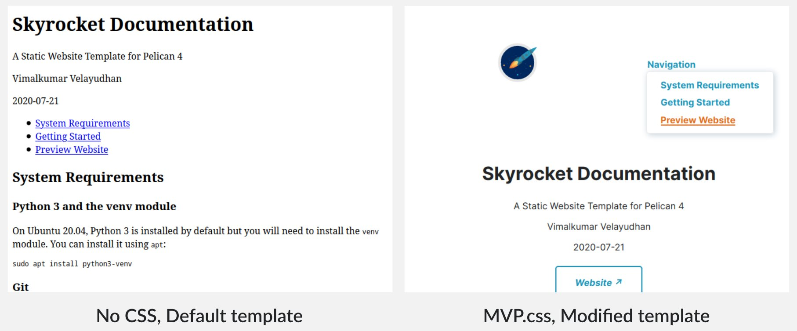

# A Pandoc HTML template with mvp.css

You can use this template to convert a Markdown file 
to HTML using [Pandoc].

[Live demo]

Once Pandoc is installed, simply run `make` in
this directory. This will convert the 
included `sample.md` to `sample.html`. 
You can modify the `Makefile`, if necessary.

[Related post] on my blog.

[Live demo]: https://vimalkvn.gitlab.io/pandoc-mvp-css/sample.html

[Pandoc]: https://pandoc.org/

[Related post]: https://vimalkvn.com/pandoc-markdown-to-html/

